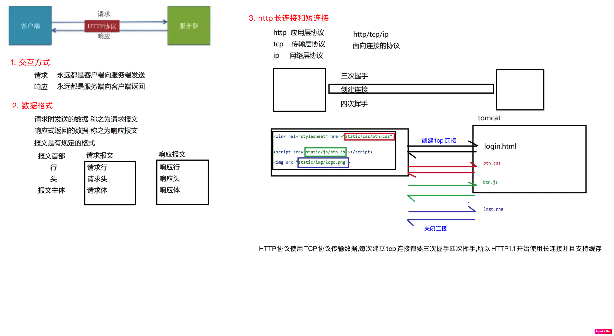

### tomcat10
```shell
# Apache Tomcat是当前应用最广的JavaWeb服务器(免费),官网下载zip包直接安装 http://tomcat.apache.org/
# Servlet & Tomcat & Java对应的版本 https://tomcat.apache.org/whichversion.html
# 添加可执行权限
[root@cdh1 ~]$ cd bin/ && sudo chmod 755 *.sh
# 启动,如果页面 http://localhost:8080 打不开可能是端口被占用,vim conf/server.xml - Connector port="8088"
[root@cdh1 ~]$ ./startup.sh
# 关闭
[root@cdh1 ~]$ ./shutdown.sh
# 日志乱码：vim conf/logging.properties,修改乱码位置的encoding

# 目录结构
# bin：存放二进制可执行文件
# conf：存放各种配置文件,server.xml & web.xml(被所有web项目共用,也可以在项目自己的web.xml配置覆盖默认值)
# lib：存放tomcat需要的各种jar包比如servlet-api.jar,该目录下的jar包被所有web项目共享
# logs：存放日志文件,记录tomcat启动和关闭信息
# temp：存放临时文件
# webapps：存放web项目,tomcat自带5个项目,比如访问examples项目 http://localhost:8088/examples/index.html
# 不指定上下文路径就是ROOT项目 http://localhost:8088/index.jsp,可以修改该文件的<h2>标签内容查看浏览器页面变化
# url组成部分和项目资源对应关系：localhost 服务器硬件ip地址,8088 服务器软件tomcat端口,examples 项目名称,index.html 项目资源

# web项目部署方式
# 1.将编译好的项目直接放到webapps目录
# 2.将编译好的项目放在磁盘上的任意目录,通过conf/Catalina/localhost/*.xml指定实际路径
# <Context path="/web01" docBase="/Users/okc/IdeaProjects/javaweb/out/artifacts/web01_war_exploded" />
```


### idea开发web项目并部署到tomcat
```shell
# idea关联tomcat,可以有多个
Intellij IDEA - Settings - Build,Execution,Development - Application Servers - Tomcat Server - Tomcat Home

# idea先创建一个空项目javaweb,然后创建普通java项目web01
File - New - Project - Java
# 检查项目的SDK,语法版本,以及项目编译后的输出目录
File - Project Structure - Project - SDK & Language Level & Compiler output
# 项目要部署到tomcat运行,添加tomcat的依赖
File - Project Structure - Modules - web01 - Dependencies - Add - Library - Application Server Libraries - Tomcat 10.1.15
# 将普通java项目转换成web项目,发现多了个带特殊标记的web目录,将废弃的index.jsp删除使用index.html代替
web01 - (double shift - Actions) - Add Framework Support - Java EE - Web Application(6.0)
# 创建resources目录并标记为资源目录,不然该目录不参与编译
web01 - resources - Mark Directory as - Resources Root
# 在web/WEB-INF下创建lib目录并标记为项目依赖,后面统一使用maven管理
web01 - web - WEB-INF - lib - Add as Library - Level - Module Library
# 查看当前项目有哪些环境依赖
File - Project Structure - Modules - web01 - Dependencies

# 将src源码和resources配置文件构建成可以发布的app,使用工具栏的Build Artifacts手动构建,或者部署到tomcat后启动服务时会自动构建(推荐)
Build - Build Artifacts - web01:war exploded - Build/Clean/Edit
Edit Configurations - Add New Configuration - Tomcat Server - Local - Deployment & Server
# 进入tomcat目录,发现项目既没有在webapps下,也没有在conf/Catalina/localhost下指定路径,是怎么部署运行的？
# 为了保证tomcat干净纯洁,防止放太多项目被污染,部署新项目时会创建一个tomcat副本,只存放当前部署项目的配置文件,项目是在这个副本里运行的
# 副本位置在Server启动日志的CATALINA_BASE,点进去发现果然有个conf/Catalina/localhost/web01.xml,后期开发使用SpringBoot内置tomcat
```


### http协议
```java
/**
 HTTP协议：超文本传输协议,规定了浏览器和服务器之间的通信规则,其实就是规定报文格式
 get请求参数显式的写在url后面 www.baidu.com/s?wd=Chinese
 post请求参数在请求体当中,以隐式的方式发送

 http请求：请求行,请求头(10~19),空行,请求体
 GET / HTTP/1.1                                                   ---> 请求行：请求方法 + url + 协议版本
 Host: fanyi.youdao.com                                           ---> 主机和端口号
 Connection: keep-alive                                           ---> 连接类型为长连接
 Upgrade-Insecure-Requests                                        ---> 升级为HTTPS请求
 Accept: application/json, text/javascript; q=0.01                ---> 浏览器接收的文件类型
 User-Agent: ...                                                  ---> 浏览器版本(重要)
 Referer: http://fanyi.youdao.com/                                ---> 页面跳转处(重要)
 Accept-Encoding: gzip, deflate                                   ---> 浏览器接收的文件压缩格式
 Accept-Language: zh-CN,zh;q=0.9                                  ---> 浏览器接收的语言,q表示权重
 Cookie: JSESSIONID-                                              ---> Cookie(重要)
 X-Requested-With: XMLHttpRequest                                 ---> 说明是ajax异步请求

 i=rabbit&from=AUTO&to=AUTO&smartresult=dict&client=fanyideskweb  ---> 请求体(post才有)

 http响应：响应行,响应头,空行,响应体
 HTTP/1.1 200 OK                                                  ---> 响应行(必须)
 ...                                                              ---> 响应头

 <!DOCTYPE html>                                                  ---> 响应体

 http状态码：告诉客户端服务器的执行状态
 200：请求成功
 301：永久性重定向,www.jindong.com --> www.jd.com
 302：临时性重定向,未登录时访问个人中心会跳转到登录页面
 304：使用了本地缓存
 403：没有权限访问
 404：找不到资源,路径不对或者访问了WEB-INF下受保护资源
 405：请求方式不允许
 500：资源找到了,但是服务器内部出现错误,代码异常1/0
 */
```

